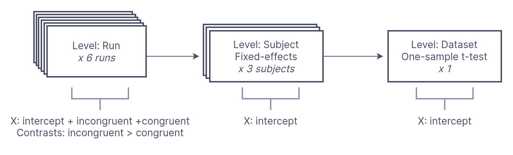

# Walkthrough 

## The problem: Representing multi-stage models

The statistical analysis of neuroimaging data typically occurs across several distinct levels of analysis, with parameter estimates from lower levels of analysis propagating to higher levels for subsequent analysis. 

For example, in fMRI it is common to first fit a design matrix to run-level time series followed by a fixed-effects model to combine estimates at the subject-level. Finally, a dataset-level random-effects one-sample t-test can be performed to estimate population level effects of the modeled regressors. At each level of the analysis, we need to know which inputs correspond to which design matrix, and more importantly how to keep track of and combine outputs from the previous level at the current level of analysis. 

*BIDS Statistical Models* proposes a general machine-readable document to describe multi-stage neuroimaging analyses in a precise, yet flexible manner. We accomplish this by defining a *graph* composed of [Nodes](_autosummary/bsmschema.models.Node.html#bsmschema-models-node) representing each level of the analysis, and [Edges](http://0.0.0.0:8000/_autosummary/bsmschema.models.Node.html#bsmschema-models-edge) which define the flow of data throughout our analysis. Within each `Node` we specify a [Model](_autosummary/bsmschema.models.Model.html#bsmschema.models.Model) to estimate, and [Contrasts](_autosummary/bsmschema.models.Contrast.html#bsmschema.models.Contrast) to compute the `Node` outputs.


## A simple example

In a [Simon task](https://openneuro.org/datasets/ds000101/versions/00004), participants were scanned for 2 runs and asked to indicate whether a diamond that was presented to the left or right of a central fixation cross was green or red. There were two types of trials: color-spatial *congruent* and *incongruent* trials. A simple analysis of this task is to determine which regions showed greater activity for incongruent versus congruent trials *(I>C)*, across participants. 

We can perform this analysis by first estimating a **run-level** timeseries model for "Incongruent" and "Congruent" trials--separately for each individual run. We then compute a contrast comparing *Incongruent > Congruent* (IvC) trials. Next, we pass the resulting statistical maps for the contrast to a **subject-level** estimator, which computes the average *IvC* effect for each subject separately. Finally, we pass the resulting estimates to a **dataset-level** estimator, which conduts a one-sample t-test across all of the subject estimates for the *IvC* contrast.

Let's visualize this model for 3 participants:



We can formally represent this analysis as **BIDS Statistical Model**:

```json
{
  "Name": "Simon IvC",
  "BIDSModelVersion": "1.0.0",
  "Input": {"Subject": ["01", "02", "03"]},
  "Nodes": [
    {
      "Level": "Run",
      "Name": "run_level",
      "GroupBy": ["run", "subject"],
      "Model": {"X": [1, "incongruent", "congruent"], "Type": "glm"},
      "Contrasts": [
        {
          "Name": "IvC",
          "ConditionList": ["incongruent", "congruent"],
          "Weights": [1, -1],
          "Test": "t"
        }
      ]
    },
    {
      "Level": "Subject",
      "Name": "subject_level",
      "GroupBy": ["subject", "contrast"],
      "Model": {"X": [1], "Type": "Meta"},
      "Contrasts": [
        {
          "Name": "IvC",
          "ConditionList": ["IvC"],
          "Weights": [1],
          "Test": "t"
        }
      ]
    },
    {
      "Level": "Dataset",
      "Name": "one-sample_dataset",
      "GroupBy": ["contrast"],
      "Model": {"X": [1], "Type": "glm"},
      "Contrasts": [
        {
          "Name": "IvC",
          "ConditionList": ["IvC"],
          "Weights": [1],
          "Test": "t"
        }
      ]
    }
  ]
}
```

```{note}
For this example, we have limited analysis to three subjects using the `Input` key. 
```

*BSM* defines this multi-stage analysis as a Graph, with each level of analysis defined as a separate `Node` object. 


### Run-level Model

First, we define a `Node` for the run level analysis. 

```json
      "Level": "Run",
      "Name": "run_level"
```

Note that the [Level](_autosummary/bsmschema.models.Node.html#bsmschema.models.Node.Level) key is necessary for determining which input images are available to the estimator. At the `Run` level, there are many sources of possible variables, most notably `_events.tsv` files which define the timing of task-related events.  

Next we define a [Model](_autosummary/bsmschema.models.Model.html#bsmschema.models.Model) for this node. 


```json
      "Model": {
        "X": [1, "incongruent", "congruent"],
        "Type": "glm"
      }
```

The [X](_autosummary/bsmschema.models.Model.html#bsmschema.models.Model.X) parameter defines the variables in the design matrix. Here, we are modeling the `incongruent` and `congruent` trial types, in addition to an intercept (idenitified by the special key: `1`; see: _).

Next, we specify an *Incongruent-Congruent (IvC)* contrast using the [Contrasts](_autosummary/bsmschema.models.Contrast.html) key:


```json
      "Contrasts": [
        {
          "Name": "IvC",
          "ConditionList": ["incongruent", "congruent"],
          "Weights": [1, -1],
          "Test": "t"
        }
      ]
```

If you have used other fMRI modeling tools this should be familar. We have specified a t-test contrast with the weights `[1, -1]` for the conditions: `["incongruent", "congruent"]` and given this contrast the name `IvC`. 

Importantly in BSM,`Contrasts` **define the outputs** that will be available to the next `Node`. 

```{note}
Since we only modeled a single contrast (`IvC`), the next `Node` will not have access to estimates for main effects for the `congruent` or `incongruent` conditions, unless we explicitly compute a `Contrast` for them.
```

#### How to group analysis inputs?

An underappreciated assumption in multi-stage models is the grouping of image inputs into analysis units. In this example, we want to estimate a timeseries model for each `Run` separately, rather that concatenating all runs for each subject into one large model.

In *BSM*, we explicitly define this grouping structure using the [GroupBy](_autosummary/bsmschema.models.Node.html#bsmschema.models.Node.GroupBy) key at every node. For example, to specify that every run image should be fit to its own model, we specify:


```json
      "GroupBy": ["run", "subject"]
```

Here, `GroupBy` states that for every unique combination of `run` and `subject`, we will fit a different model. In this instance, this results in a single image per analysis. 

If you are familar with tabular data such as R `DataFrames`, or `pandas`, the `GroupBy` operation should be familar. For instance, given three subjects with two runs each, we can define 6 rows in a table (3x2):

| image       | subject     | run |
| ----------- | ----------- | ----------- |
| sub-01_task-simon_run-1_bold.nii.gz      | "1"       | 1       |
| sub-01_task-simon_run-2_bold.nii.gz   | "1"        | 2        |
| sub-02_task-simon_run-1_bold.nii.gz      | "2"       | 1       |
| sub-02_task-simon_run-2_bold.nii.gz   | "2"        | 2        |
| sub-03_task-simon_run-1_bold.nii.gz      | "3"       | 1       |
| sub-03_task-simon_run-2_bold.nii.gz   | "3"        | 2        |

If we `GroupBy` *subject*, there would be three groups of images--one for each subject. If we `GroupBy` *run*, all images with the same *run* ID would be grouped together, resulting in two groups, one for each distinct group ID. 

However, since we want to model each `BOLD` image separately, we must `GroupBy` **both *subject* and *run***, resulting in six groups with a single image each. 

### Subject level Node

#### From Run Outputs to Subject Inputs

So far, we've defined a `Run` level model to fit a simple model to BOLD timeseries and compute a `[1, -1]` contrast for `I>C`. Next, we want to define a fixed-effects model to combine contrast effects from each subject's runs together. 

```json
      "Level": "Subject",
      "Name": "subject_level",
      "GroupBy": ["subject", "contrast"],
```

Note that with 3 subjects and 2 runs, we will have 6 groups of output images from the `Run` node. By default, `Nodes` are linked sequentially, with all the `Contrast` outputs from one `Node` available to the subsequent `Node`. 

Remember that the `Level` key sets variables that become available at each level (in this case from `_scans.tsv`). However, we need to explicilty use `GroupBy` to define how to group the outputs from the `Run` node as inputs to the `Subject` level-- in this case as `["subject", "contrast"]`. Here are are specifying that all images beloning to a single `subject` and from a single `contrast` should be grouped together. In this case, we only have one `contrast`, but we still include this as a grouping variable.

Given two types of images `variance` and `effect`, this would result in 12 images that would be grouped as follows:


| image       | subject     | run | contrast |
| ----------- | ----------- | ----------- | ----------- |
| sub-01_task-simon_run-1_contrast-IvC-effect_statmap.nii.gz | "1" | 1 | "IvC" |
| sub-01_task-simon_run-1_contrast-IvC-variance_statmap.nii.gz | "1"| 1| "IvC" |
| sub-01_task-simon_run-2_contrast-IvC-effect_statmap.nii.gz | "1"| 2| "IvC" |
| sub-01_task-simon_run-2_contrast-IvC-variance_statmap.nii.gz | "1"| 2| "IvC" |
| - | - | - | - |
| sub-02_task-simon_run-1_contrast-IvC-effect_statmap.nii.gz | "2"| 1| "IvC" |
| sub-02_task-simon_run-1_contrast-IvC-variance_statmap.nii.gz | "2"| 1| "IvC" |
| sub-02_task-simon_run-2_contrast-IvC-effect_statmap.nii.gz | "2"| 2| "IvC" |
| sub-02_task-simon_run-2_contrast-IvC-variance_statmap.nii.gz | "2"| 2| "IvC" |
| - | - | - | - |
| sub-03_task-simon_run-1_contrast-IvC-effect_statmap.nii.gz | "3"| 1| "IvC" |
| sub-03_task-simon_run-1_contrast-IvC-variance_statmap.nii.gz | "3"| 1| "IvC" |
| sub-03_task-simon_run-2_contrast-IvC-effect_statmap.nii.gz | "3"| 2| "IvC" |
| sub-03_task-simon_run-2_contrast-IvC-variance_statmap.nii.gz | "3"| 2| "IvC" |


#### Subject-level Model

We can now specify the `Subject` level `Model`. Since our intent is to estimate the *mean* for each subject, we only need an intercept (`1`) in our model. We specify the `"Type"` to be `Meta`, which is a special type to identify fixed-effects models (see: _).

Remember that we must specify `Contrasts` in order to produce outputs for the next `Node`. Here, we compute a simple identity identity contrast to pass forward the subject-evel estimates forward. Note that we specified the `Test` as `skip`, since we don't want to perform a t-test, but simply pass forward parameter and variance estimates.   

```json
      "Model": {
        "X": [1], 
        "Type": "Meta"
      },
      "Contrasts": [
        {
          "Name": "IvC",
          "ConditionList": ["IvC"],
          "Weights": [1],
          "Test": "skip"
        }
      ]
```

### Dataset level Node

At this stage, we are ready to perform a one-sample t-test in order to estimate population-level effects for our `Contrast`. We refer to this level as the `Dataset` level. 


```json
      "Level": "Dataset",
      "Name": "one-sample_dataset",
      "GroupBy": ["contrast"],
```


Here we only need to `GroupBy` `contrast`, as we want a separate estimate for each contrast, but want to include all subjects in the same analysis. Since we only  have one `contrast`, all the incoming subject-level images will be grouped together:

| image       | subject     | contrast |
| ----------- | ----------- | ----------- |
| sub-01_task-simon_contrast-IvC-effect_statmap.nii.gz | "1" | "IvC" |
| sub-01_task-simon__contrast-IvC-effect_statmap.nii.gz | "1"| "IvC" |
| sub-02_task-simon__contrast-IvC-effect_statmap.nii.gz | "2"|  "IvC" |
| sub-02_task-simon_contrast-IvC-effect_statmap.nii.gz | "2"| "IvC" |
| sub-03_task-simon_contrast-IvC-effect_statmap.nii.gz | "3"| "IvC" |
| sub-03_task-simon_contrast-IvC-effect_statmap.nii.gz | "3"| "IvC" |


As before, we can simply specify an intercept-only model, but of a `glm` type since we want to perform a random-effects analysis. We can also specify a single identity t-test `Contrast` for a one-sample dataset-level test.

```json
      "Model": {
        "X": [1],
        "Type": "glm"
      },
      "Contrasts": [
        {
          "Name": "IvC",
          "ConditionList": ["IvC"],
          "Weights": [1],
          "Test": "t"
        }
      ]
    }
```

### Final Model

```json
{
  "Name": "Simon IvC",
  "BIDSModelVersion": "1.0.0",
  "Nodes": [
    {
      "Level": "Run",
      "Name": "run_level",
      "GroupBy": ["run", "subject"],
      "Model": {
        "X": [1, "incongruent", "congruent"],
        "Type": "glm"
      },
      "Contrasts": [
        {
          "Name": "IvC",
          "ConditionList": ["incongruent", "congruent"],
          "Weights": [1, -1],
          "Test": "t"
        }
      ]
    },
    {
      "Level": "Subject",
      "Name": "subject_level",
      "GroupBy": ["subject", "contrast"],
      "Model": {
        "X": [1], 
        "Type": "Meta"
      },
      "Contrasts": [
        {
          "Name": "IvC",
          "ConditionList": ["IvC"],
          "Weights": [1],
          "Test": "t"
        }
      ]
    },
    {
      "Level": "Dataset",
      "Name": "one-sample_dataset",
      "GroupBy": ["contrast"],
      "Model": {
        "X": [1],
        "Type": "glm"
      },
      "Contrasts": [
        {
          "Name": "IvC",
          "ConditionList": ["IvC"],
          "Weights": [1],
          "Test": "t"
        }
      ]
    }
  ]
}
```