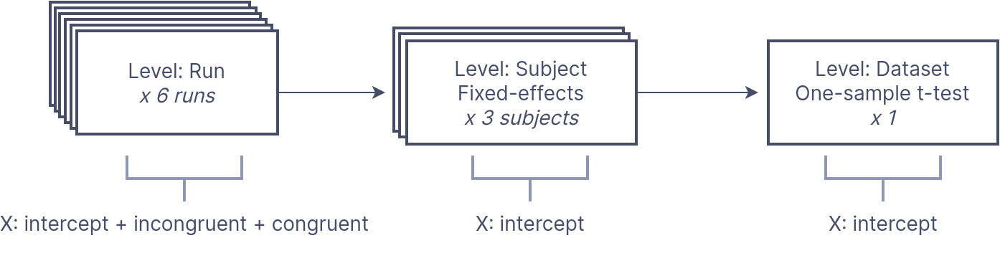

---
jupytext:
  formats: md:myst
  text_representation:
    extension: .md
    format_name: myst
kernelspec:
  display_name: Python 3
  language: python
  name: python3
---

# Walkthrough 

## The problem: Representing multi-stage models

The statistical analysis of neuroimaging data typically occurs across distinct stages of analysis, with parameter estimates from lower levels of analysis propagating to higher levels for subsequent analysis. 

For example, in fMRI it is common to first fit a design matrix to run-level time series followed by a fixed-effects model to combine estimates at the subject-level. Finally, a dataset-level (or "group level") random-effects one-sample t-test can be performed to estimate population level effects. At each level of the analysis, we need to know which image inputs correspond to which design matrix, and more how to keep track of and combine outputs from the previous level at the current level of analysis. 

*BIDS Stats Models* proposes a general machine-readable document to describe multi-stage neuroimaging analyses in a precise, yet flexible manner. We accomplish this by defining a *graph* composed of **Nodes** representing each level of the analysis and **Edges** which define the flow of data from one Node to another. Within each {py:class}`~bsmschema.models.Node` we specify a {py:class}`~bsmschema.models.Model` to estimate, and at least one {py:class}`~bsmschema.models.Contrast` to define the computed outputs of each `Node`. Within each node we also specify how to group the incoming inputs into analysis units using the {py:attr}`~bsmschema.models.Node.GroupBy` directive.


## A simple example

In a [Simon task](https://openneuro.org/datasets/ds000101/versions/00004), participants were scanned for 2 runs and asked to indicate whether a diamond that was presented to the left or right of a central fixation cross was green or red. There were two conditions: color-spatial *congruent* and *incongruent* trials.

A basic analysis of this task is to determine which regions showed *greater activity for incongruent versus congruent trials*, across all participants. 

We can perform this analysis by first estimating a **run-level** timeseries model for "Incongruent" and "Congruent" trials--separately for each individual run. We then compute a contrast comparing *Incongruent > Congruent* (IvC) trials. Next, we pass the resulting statistical maps for the contrast to a **subject-level** estimator, which computes the average *IvC* effect for each subject separately. Finally, we pass the resulting estimates to a **dataset-level** estimator, which conduts a one-sample t-test across all of the subject estimates for the *IvC* contrast.

Let's visualize this model for 3 participants:



We can formally represent this analysis as **BIDS Stats Model**:

```{literalinclude} examples/model-walkthrough_smdl.json
:language: JSON
```

```{note}
For this example, we have limited the model to three subjects using the `Input` key. 
```

*BSM* defines this multi-stage analysis as a Graph, with each level of analysis defined as a separate `Node` object. 


### Run-level Model

First, we define a `Node` for the run level analysis. 

```{literalinclude} examples/model-walkthrough_smdl.json
:language: JSON
:start-at: '"Level": "Run"'
:lines: 1-2
```

Note that the {py:attr}`~bsmschema.models.Node.Level` key is necessary for determining which input images are available to the estimator. At the `Run` level, there are many sources of possible variables, most notably `_events.tsv` files which define the timing of task-related events.  

Next we define a {py:attr}`~bsmschema.models.Model` for this node. 


```{literalinclude} examples/model-walkthrough_smdl.json
:language: JSON
:start-at: '"Model": {"X": [1,'
:lines: 1
```

The {py:attr}`~bsmschema.models.Model.X` parameter defines the variables in the design matrix. Here, we are modeling the `incongruent` and `congruent` trial types, in addition to an intercept (idenitified by the special key: `1`; see: \_).

Next, we specify an *Incongruent-Congruent (IvC)* contrast using the {py:attr}`~bsmschema.models.Contrast` key:


```json
      "Contrasts": [
        {
          "Name": "IvC",
          "ConditionList": ["incongruent", "congruent"],
          "Weights": [1, -1],
          "Test": "t"
        }
      ]
```

If you have used other fMRI modeling tools this should be familar. We have specified a t-test contrast with the weights `[1, -1]` for the conditions: `["incongruent", "congruent"]` and given this contrast the name `IvC`. 

```{attention}
`Contrasts` **define the outputs** that will be available to the next `Node`. 

Since we only modeled a single contrast (`IvC`), the next `Node` will not have access to estimates for main effects for the `congruent` or `incongruent` conditions, unless we explicitly compute a `Contrast` for each.
```

#### How to *group* analysis inputs?

An underappreciated factor in multi-stage models is the grouping of image inputs into analysis units. For example, here we want to estimate a timeseries model for each `Run` separately, rather that concatenating all runs for each subject into one large model.

We must explicitly define this grouping structure using the {py:attr}`~bsmschema.models.Node.GroupBy` key for every node. To fit a separate time series model for each individual run image, we specify:


```json
      "GroupBy": ["run", "subject"]
```

Here, `GroupBy` states that for every unique combination of `run` and `subject`, we will fit a separate model. This results in a single input image per model. 

If you are familar with tabular data such as R `DataFrames`, or `pandas`, the `GroupBy` operation should be familar. For instance, given three subjects with two runs each, we can define 6 rows in a table (3x2):

```{code-cell} python3
---
tags: ["remove_input"]
---
from IPython.display import display
import pandas as pd
pd.set_option('display.max_colwidth', None)

subjects = ["01", "02", "03"]
runs = [1, 2]
# For later use
contrasts = ["IvC"]
stats = ["effect", "variance"]

def display_groups(df, groups):
    for group in df.groupby(groups, as_index=False):
        display(group[1].style.hide(axis="index"))

inputs = pd.DataFrame.from_records(
  [{
     "subject": subject,
     "run": run,
     "image": f"sub-{subject}_task-simon_run-{run}_bold.nii.gz",
   } for subject in subjects for run in runs]
)
display(inputs.style.hide(axis="index"))
```

If we `GroupBy` *subject*, there would be three groups of images--one for each subject:

```{code-cell} python3
---
tags: ["remove_input"]
---
display_groups(inputs, "subject")
```

If we `GroupBy` *run*, all images with the same *run* ID would be grouped together, resulting in two groups, one for each distinct group ID:

```{code-cell} python3
---
tags: ["remove_input"]
---
display_groups(inputs, "run")
```

However, since we want to model each `BOLD` image separately, we must `GroupBy` **both *subject* and *run***, resulting in six groups with a single image each. 

```{code-cell} python3
---
tags: ["remove_input"]
---
display_groups(inputs, ["run", "subject"])
```

### Subject level Node

#### From Run Outputs to Subject Inputs

Next, we define a fixed-effects model to combine contrast outputs from each subject's runs together. 

```{note}
By default, `Nodes` are linked sequentially, with all the `Contrast` outputs from a `Node` available to the subsequent `Node`. 
```

We need to use `GroupBy` to define how to group the outputs from the `Run` node as inputs to the `Subject` level:

```json
      "Level": "Subject",
      "Name": "subject_level",
      "GroupBy": ["subject", "contrast"],
```

Here we are specifying that all images belonging to a single `subject` and from a single `contrast` should be grouped together for analysis.

Note that with 3 subjects and 2 runs, we will have 6 groups of output images from the `Run` node. Given two types of images (`variance` and `effect`), this results in 12 images that would be grouped as follows:

```{code-cell} python3
---
tags: ["remove_input"]
---
outputs = pd.DataFrame.from_records(
  [{
     "subject": subject,
     "run": run,
     "contrast": contrast,
     "image": f"sub-{subject}_task-simon_run-{run}_"
              f"contrast-{contrast}_stat-{stat}_statmap.nii",
   }
   for subject in subjects for run in runs
   for contrast in contrasts for stat in stats]
)
display_groups(outputs, ["subject", "contrast"])
```

```{tip}
In this example there is only one `contrast`, but we include `contrast` as a grouping variable to be explicit.
```

#### Subject-level Model

We can now specify the `Subject` level `Model`. Since our intent is to estimate the *mean* for each subject, we only need an intercept (`1`) in our model. We specify the `"Type"` to be `Meta`, which is a special type to identify fixed-effects models.

Remember that we must specify `Contrasts` in order to produce outputs for the next `Node`. Here, we compute a simple identity contrast to pass forward the subject-evel estimates forward. Note that we specified the `Test` as `pass`, since we don't want to perform a t-test, but simply need to compute and pass forward parameter and variance estimates.

```json
      "Model": {
        "X": [1], 
        "Type": "Meta"
      },
      "Contrasts": [
        {
          "Name": "IvC",
          "ConditionList": ["IvC"],
          "Weights": [1],
          "Test": "pass"
        }
      ]
```

### Dataset level Node

We are ready to perform a one-sample t-test to estimate population-level effects for the *IvC* `Contrast`. We refer to this level as the `Dataset` level. 


```json
      "Level": "Dataset",
      "Name": "one-sample_dataset",
      "GroupBy": ["contrast"],
```


Here we only need to `GroupBy` `contrast`, as we want a separate estimate for each contrast, but want to include all subjects in the same analysis. Since we only have one `contrast`, all the incoming subject-level images will be grouped together:

```{code-cell} python3
---
tags: ["remove_input"]
---
outputs = pd.DataFrame.from_records(
  [{
     "subject": subject,
     "contrast": contrast,
     "image": f"sub-{subject}_task-simon_"
              f"contrast-{contrast}_stat-{stat}_statmap.nii",
   }
   for subject in subjects
   for contrast in contrasts for stat in stats]
)
display_groups(outputs, ["contrast"])
```

As before, we can specify an intercept-only model, but of type `glm` since we want to perform a random-effects analysis. We also specify a single identity t-test `Contrast` in order to compute the output of this `Node`.

```json
      "Model": {
        "X": [1],
        "Type": "glm"
      },
      "Contrasts": [
        {
          "Name": "IvC",
          "ConditionList": ["IvC"],
          "Weights": [1],
          "Test": "t"
        }
      ]
    }
```

The outputs of this node collapse across subjects, leaving a single effect/variance pair:

```{code-cell} python3
---
tags: ["remove_input"]
---
outputs = pd.DataFrame.from_records(
  [{
     "contrast": contrast,
     "image": f"task-simon_contrast-{contrast}_stat-{stat}_statmap.nii",
   }
   for contrast in contrasts for stat in stats]
)
display_groups(outputs, ["contrast"])
```
